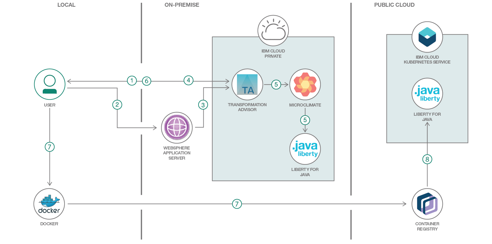
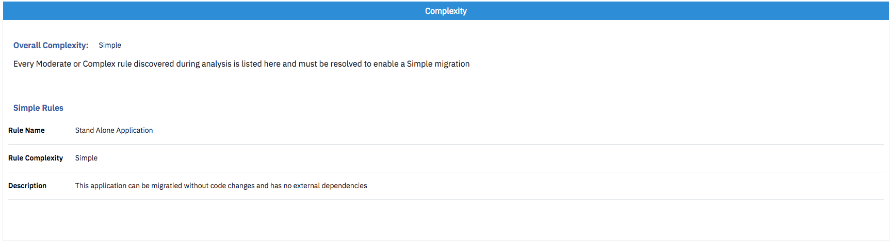

# App Modernization using Transformation Advisor and Microclimate

In this code pattern, we will use Transformation Advisor to evaluate an on-premise traditional WebSphere application for deployment on public and/or private cloud environments. We'll use Transformation Advisor's integration with Microclimate to deploy the app in a Liberty container running on IBM Cloud Private. We'll also download the generated migration bundle and use its Helm chart to deploy the containerized app to IBM Cloud Kubernetes Service (public cloud).

A sample web app is provided to demonstrate migration from on-premise to the cloud.

When the reader has completed this code pattern, they will understand how to:

* Use Transformation Advisor to create a custom Data Collector
* Run the custom Data Collector to analyze a traditional WebSphere app
* Review the Transformation Advisor reports to see migration complexity, cost, and recommendations
* Generate artifacts to containerize the app
* Move the modernized app to IBM Cloud Private using Microclimate
* Move the modernized app to IBM Cloud Kubernetes Service using a generated migration bundle



## Flow
1. Developer downloads a custom Data Collector from Transformation Advisor
2. Developer runs the Data Collector on the traditional WebSphere Application Server host
3. Data Collector analysis is uploaded (automatically or manually)
4. Developer reviews recommendations in Transformation Advisor and creates a migration bundle
5. Transformation Advisor deploys the modernized app as a containerized Liberty app on IBM Cloud Private via Microclimate
6. Developer downloads migration bundle
7. Developer uses Docker to build an image and upload it to IBM Cloud Container Registry
8. Developer uses generated Helm chart to deploy the modernized app as a containerized Liberty app on IBM Cloud Kubernetes Service

## Included components
* [Transformation Advisor](https://www.youtube.com/watch?v=yBZVb0KfPlc): Not every workload should move to cloud. The right choice can yield large cost savings and speed time to market. The Transformation Advisor tool can help you decide.
* [Microclimate](https://microclimate-dev2ops.github.io/videos/Microclimateoverview.mp4): Create, build, test and deploy applications in one seamless experience to help development teams modernize existing applications.
* [IBM Cloud Kubernetes Service](https://cloud.ibm.com/docs/containers/container_index.html): IBM Cloud Kubernetes Service manages highly available apps inside Docker containers and Kubernetes clusters on the IBM Cloud.
* [WebSphere Liberty](https://developer.ibm.com/wasdev/websphere-liberty): A dynamic and easy-to-use Java EE application server, with fast startup times, no server restarts to pick up changes, and a simple XML configuration.

## Featured technologies
* [IBM Cloud Private](https://www.ibm.com/cloud/private): Drive innovation. Transform your enterprise. IBM Cloud Private: speed of public, control of private. IBM Cloud. The cloud for smarter business.
* [Cloud](https://developer.ibm.com/depmodels/cloud/): Accessing computer and information technology resources through the Internet.
* [Containers](https://www.ibm.com/cloud/container-service): Virtual software objects that include all the elements that an app needs to run.
* [Java](https://java.com/): A secure, object-oriented programming language for creating applications.

# Watch the Video
[](https://www.youtube.com/watch?v=lzFI4e3Ed68)

# Prerequisites

* [IBM Cloud Private](https://www.ibm.com/cloud/private)

# Steps

1. [Verify Microclimate prerequisites](#1-verify-microclimate-prerequisites)
1. [Get started with the Transformation Advisor](#2-get-started-with-the-transformation-advisor)
1. [Download and run the Data Collector](#3-download-and-run-the-data-collector)
1. [Upload results, if necessary](#4-upload-results-if-necessary)
1. [View the recommendations and cost estimates](#5-view-the-recommendations-and-cost-estimates)
1. [Complete your migration bundle](#6-complete-your-migration-bundle)
1. [Create a GitHub or GitLab repository](#7-create-a-github-or-gitlab-repository)
1. [Deploy your application](#8-deploy-your-application)
1. [Deploy to IBM Cloud Kubernetes Service (IKS)](#9-deploy-to-ibm-cloud-kubernetes-service-iks)

## 1. Verify Microclimate prerequisites

### Before you install Microclimate!
Before you install Microclimate, decide if you will deploy to the IBM Cloud Kubernetes Service (IKS)!

> In order to be able to deploy to IKS, you need to specify a Docker registry URL in the `jenkins.Pipeline.Registry.URL` property when you install Microclimate. Both Microclimate and IKS need to access this registry.
The [Deploy to IBM Cloud Kubernetes Service (IKS)](#9-deploy-to-ibm-cloud-kubernetes-service-iks)
instructions assume the use of the IBM Cloud Container Registry.
For the IBM Cloud Container Registry, the Docker registry URL should be in the following format:
`registry.<region>.bluemix.net/<my_namespace>`

### Ensure that you have Microclimate running
Ensure that you have Microclimate running on IBM Cloud Private and take note of its URL.
If you do not see Microclimate in your deployments, you will need to install Microclimate from the Helm chart. The instructions for deploying Microclimate are
[here](https://github.com/IBM/charts/blob/master/stable/ibm-microclimate/README.md).

To find your Microclimate deployment:

* Go to your IBM Cloud Private UI and use the `☰` button to show the sidebar menu.

* Select `Workloads ▷ Deployments`.

  

* You should see Microclimate deployments listed. Go to the `Launch` link and launch the portal.

  

* This will take you to the Microclimate Projects page. Take note of the URL. You will need this later. For example:

  

## 2. Get started with the Transformation Advisor

If you do not yet have the Transformation Advisor installed follow the installation instructions [here](https://developer.ibm.com/recipes/tutorials/deploying-transformation-advisor-into-ibm-cloud-private/).

To get started with the Transformation Advisor:

* Go to your IBM Cloud Private UI and use the `☰` button to show the sidebar menu.

* Select `Platform ▷ Transformation`.

  

* On the welcome screen, click the `+` to add a workspace.

  

* Create a new workspace that will be used to house your recommendations. The workspace name can be any string you want, such as the project name or the name for the portfolio of applications you will be analysing -- basically anything that will help you to easily identify your work when you return to it at a later date.

  

* You will then be asked to enter a collection name. This is an opportunity for you to subdivide your work even further into a more focused grouping. It would typically be associated with a single run of the Data Collector and may be the name of the individual WAS server that you will be running the Data Collector on. It can be any string and can be deleted later -– so don’t be afraid to get creative!

  

* Hit `Let’s Go`.

## 3. Download and run the Data Collector

> If you don't want to run our sample app and the Data Collector in your own WAS environment, you can use the files that we already collected and saved in [data/examples](data/examples). Just upload them in [the next step](#4-upload-results-if-necessary) to continue.

The Data Collector identifies which profiles are associated with the WebSphere installation along with the installed WebSphere and Java versions. It also identifies all WebSphere applications within each deployment manager and standalone profile. The tool generates one folder per profile and places analysis results within that directory.

> Note: The Data Collector will collect configuration information in WAS installations at version 7 or later.

### Download the Data Collector

The Data Collector tab should now display the screen shown below. The Data Collector is a downloadable zip file that needs to be extracted and run on your target server where the applications you wish to migrate are located (i.e., your WAS application server machine). You should choose the correct Data Collector for your target server’s operating system.


* Download the zip file to your browser's download directory.

  

### Install and run

> **WARNING:** The Data Collector is likely to consume a significant amount of resources while gathering data. Therefore, we recommend you run the tool in a pre-production environment. Depending on the number, size and complexity of your applications the Data Collector may take quite some time to execute and upload results.

Once downloaded, follow these steps:

* Copy/FTP from your download directory to your target server. Put the zip file in a directory where you have read-write-execute access.

* Decompress the downloaded file. Your file name will be specific to your platform/version/collection.
  ```
  tar xvfz transformationadvisor-2.1_Linux_example.tgz
  ```

* Go to the Data Collector directory.
  ```
  cd transformationadvisor-2.1
  ```
* Perform analysis of app, .ear and .war files on IBM WebSphere applications.
  ```
  ./bin/transformationadvisor -w <WEBSPHERE_HOME_DIR> -p <PROFILE_NAME> <WSADMIN_USER> <WSADMIN_PASSWORD> -no-version-check
  ```

## 4. Upload results, if necessary

If there is a connection between your system and your new collection, the Data Collector will send your application data for you. Use the `Recommendations` tab to see the results and continue with the following section:
[5. View the recommendations and cost estimates](#5-view-the-recommendations-and-cost-estimates).

If there is no connection, the Data Collector will return a .zip file containing your application data. Use the `Recommendations` tab to upload the .zip file(s).

* Find the results for each profile. These are zip file(s) created by the Data Collector with the same name as the profile. You will find the zip file(s) in the transformationadvisor directory of the Data Collector.

* Copy the zip file(s) to your local system and select them use the `Drop or Add File` button.

* Use the `Upload` button to upload the files.

## 5. View the recommendations and cost estimates

Selecting the `Recommendations` tab after the Data Collector has completed and uploaded results should display a screen similar to that shown below. Please be aware that any cost estimates displayed by the tool are high-level estimates only and may vary widely based on skills and other factors not considered by the tool.

> Note: You can use the `Advanced Settings` gear icon to change the `Dev cost multiplier` and `Overhead cost` and adjust the estimates for your team.


The recommendations tab shows you a table with a summary row for each application found on your application server. Each row contains the following information:

| Column | Description |
| ------ | ----------- |
| | *A drop-down arrow lets you expand the summary row to see the analysis for other targets.* |
| | *Alert icons may appear to indicate apps that are incompatible with a target.* |
| Application | *The name of the EAR/WAR file found on the application server.* |
| | *An indicator to show how complex Transformation Advisor considers this application to be if you were to migrate it to the cloud.* |
| Tech match | *This is a percentage and if less than 100% it indicates that there may be some technologies that are not suitable for the recommended platform. You should investigate the details and ensure your application is actually using the technologies.* |
| Dependencies | *This shows potential external dependencies detected during the scan. Work may be needed to configure access to these external dependencies.* |
| Issues | *This indicates the number and severity of potential issues migrating the application.* |
| Est. dev cost | *This is an estimate in days of the development effort to perform the migration.* |
| Total effort | *This is the total estimate in days of the overhead and development costs in migration up to the point of functional testing.* |
| | *The `Migration plan` button will take you to the Migration page for the application.* |

Each column in the table is sortable. There is also a `Search items` box which allows you to filter out rows of data. You can use the `+` symbol to see only rows that match all your terms (e.g., `Liberty+Simple`). You can filter by complexity using the filter button.

Clicking on your application name will take you to more information about the discovered `Complexity` and `Application Details`. For starters, the complexity rating is explained for you.



You will also see details for each issue and dependency discovered:


There will be additional sections to show any technology issues, external dependencies, and additional information related to your application transformation.

Scroll to the end of the recommendations screen to find three links to further detailed reports.


The three reports are described as follows:

### Analysis Report

The binary scanner’s detailed migration report digs deeper to understand the nitty-gritty details of the migration. The detailed report helps with migration issues like deprecated or removed APIs, Java SE version differences, and Java EE behavior differences. Please note that the Transformation Advisor uses a rule system based on common occurring events seen in real applications to enhance the base reports and to provide practical guidance. As a result of this some items may show a different severity level in Transformation Advisor than they do in the detailed binary scanner reports.


### Technology Report

The binary scanner can examine your application and generate the Application Evaluation Report, which shows which editions of WebSphere Application Server are best suited to run the application. The report provides a list of Java EE programming models that are used by the application, and it indicates on which platforms the application can be supported.


### Inventory Report

The binary scanner has an inventory report that helps you examine what’s in your application including the number of modules and the technologies in those modules. It also gives you a view of all the utility JAR files in the application that tend to accumulate over time. Potential deployment problems and performance considerations are also included.


## 6. Complete your migration bundle

Select the Application you wish to migrate from the `Recommendations` tab and hit the `Migration plan` button.

Transformation Advisor will automatically generate the artifacts you need to get your application deployed and running in a Liberty container on IBM Cloud Private, including...

* server.xml
* Dockerfile
* Helm Charts
* deployment.yaml

It also creates the build artifacts needed by Microclimate to build and deploy your application, including...

* Jenkinsfile
* pom.xml

You will need to add the application binary itself (EAR/WAR file) and any external dependencies that may be particular to your application such as database drivers. These files can easily be added on the migration plan page at the click of a button.


Once all required application dependencies are uploaded, you will be able to use the buttons to `Download bundle` and/or `Deploy Bundle`.

* To deploy to IBM Cloud Private, press the `Deploy Bundle` button and continue with steps 7 and 8 (
[Create a GitHub or GitLab repository](#7-create-a-github-or-gitlab-repository) and
[Deploy your application](#8-deploy-your-application))
to automatically deploy the application using Microclimate.

* To manually deploy to IBM Cloud Kubernetes Service,
hit the `Download bundle` button and follow step 9
([Deploy to IBM Cloud Kubernetes Service (IKS)](#9-deploy-to-ibm-cloud-kubernetes-service-iks)).

## 7. Create a GitHub or GitLab repository

If you don’t already have a GitHub account that you can use, signup for one [here](https://github.com/join?source=header-home).

* Once you have an account, create a repository to upload your migrating application to.

  

* Take note of the URL to your Git repository.
* Optionally, generate an access token (so you don't need to use your password).
  * Go to your user settings and select `Developer settings` and then `Personal access tokens`.
  * Click on the `Generate new token` button, give it a description and define scopes and then hit `Generate token`.
  * Copy the token! You will need it later.

## 8. Deploy your application

After you hit the `Deploy Bundle` button, you will be asked on the next screen to fill in the details you saved from earlier steps as shown below...


Use the Git URL and credentials and the Microclimate URL you gathered earlier. The Microclimate project name can be anything you want as long as it’s unique and a lowercase string.

Hit the `Deploy` button and Transformation Advisor will begin the three-step process of deploying the application to IBM Cloud Private by...
1. Pushing the bundle to Git
1. Connecting with Microclimate and creating a project
1. Kicking off the Jenkins pipeline in Microclimate to pull the migration bundle from Git, containerize your application, and deploy it.

Once these steps are complete, you should see the three steps complete as below.


You can see the files you have pushed to Git by following the `View bundle in Github` link. If you wish, you can edit the migration bundle files directly in Git.


At this point TA has handed off the build and deployment work to Microclimate. You can follow the links to `View and edit project in Microclimate` or `View and track pipeline in Jenkins`.

If you chose to view the project, you will be taken to Microclimate Projects UI.


If you chose to track the pipeline, you will be taken to Jenkins.


It may take several minutes to complete, you can view the log files for each stage from this UI also.

Once complete you can go back to the ICP Dashboard and check that your application is deployed and running. Check under `Workloads ▷ Deployments` in the `☰` "hamburger" menu.

Access the migrated app on ICP by going to this address (note the fragment for the resorts app example):
```
http://<Ingress IP>:<TCP PORT>/resorts/
```

## 9. Deploy to IBM Cloud Kubernetes Service (IKS)

### Prerequisites

* You must have at least one cluster available on IKS. If not, create one following this [guide](https://cloud.ibm.com/docs/containers/cs_tutorials.html#cs_cluster_tutorial). Hint: Follow the [In the IBM Cloud console](https://cloud.ibm.com/containers-kubernetes/catalog/cluster/create) link. It's the easy path.

* You must have the following installed in your developer environment:
  * [Docker](https://www.docker.com/get-started)
  * [Helm CLI](https://www.ibm.com/support/knowledgecenter/en/SSBS6K_1.2.0/app_center/create_helm_cli.html)
  * [IBM Cloud CLI](https://cloud.ibm.com/docs/cli/reference/ibmcloud/download_cli.html#install_use)
  * [IBM Kubernetes CLI](https://kubernetes.io/docs/tasks/tools/install-kubectl/)

### Install IBM Cloud Container plug-ins

1. Run the following commands to add the IBM Cloud Container plug-ins to your IBM Cloud CLI:
   ```
   ibmcloud plugin install container-registry -r Bluemix
   ibmcloud plugin install container-service -r Bluemix
   ```

1. You can confirm that all required plugins (container-registry and container-service) are installed with this command:
   ```
   ibmcloud plugin list
   ```

### Setup IKS for Microclimate (in your dev environment)

1. Login to IKS from a terminal (use `ibmcloud help login` to see more options):
   ```
   ibmcloud login
   ```
   Afterwards, a one time passcode link will be prompted. Go to that link and copy the passcode back to the terminal to proceed.

1. Set the region to your cluster's region (use `ibmcloud ks regions` to see all available regions):
   ```
   ibmcloud cs region-set <region-name>
   ```

1. Login to the IBM Cloud Container Registry:
   ```
   ibmcloud cr login
   ```

1. Find your namespace in the list:
   ```
   ibmcloud cr namespace-list
   ```

1. Add a Microclimate token:

   To deploy to the IKS, the Microclimate Helm chart must be configured so that pipelines push images to a registry that is accessible by both IBM Cloud Private and IKS, for example, the IBM Cloud Container Registry. For the IBM Cloud Container Registry, the Docker registry URL should be in the format:
   ```
   registry.<region>.bluemix.net/<my_namespace>
   ```
   To access the registry, Microclimate needs a non-expiring token with read-write access. This can be created by using the IBM Cloud Container Registry command line plugin as follows:
   ```
   ibmcloud cr token-add --description "Microclimate token" --non-expiring --readwrite
   ```

   The Docker registry secret for Microclimate should specify this token as the password, and a username of `token`. Run the following command with your own `<token_value>`, `<region>`, and `<namespace>`.
   ```
   kubectl create secret docker-registry microclimate-registry-secret \
     --docker-server=registry.<region>.bluemix.net/<namespace> \
     --docker-username=token \
     --docker-password=<token_value> \
     --docker-email=null
   ```
   The default service account in the IKS namespace to which applications are deployed must be configured to have at least read access to this registry.

1. Initialize Helm:

   The IKS cluster must also have Helm initialized without TLS authentication:
   ```
   helm init
   ```
   > Note: Microclimate has been tested with Helm versions 2.7.2 and 2.8.2.

1. Set the CLI context to your cluster (use `ibmcloud ks clusters` to list all):

   Access to the IKS cluster is provided to Microclimate by defining a secret containing the cluster configuration. The cluster configuration can be retrieved from IKS by using the IKS command line plugin and the following command:
   ```
   ibmcloud cs cluster-config <cluster_name>
   ```
   This exports a `*.yml` file that contains the configuration and a corresponding certificate in a `*.pem` file. **Do not export the `KUBECONFIG` environment variable** as instructed by the command output as this may result in additional cluster configuration being added to the file.

1. Create and label a secret:

   Change to the directory that contains the `*.yml` and `*.pem` files and then issue the following commands to create a secret in the namespace that contains Microclimate, labelled to indicate that it contains a cluster configuration.
   The secret name can be any valid Kubernetes resource name.
   ```
   kubectl create secret generic <secret_name> \
     --from-file=kube-config.yml=<yaml_file>.yml \
     --from-file=<certificate_file>.pem
   kubectl label secret <secret_name> microclimate-type=cluster-config
   ```

### Deploy the app to IKS

1. Copy the Migration Bundle that you downloaded from Transformation Advisor to the machine
where you have completed the install of the CLIs above.

1. Unzip the zip file. Use the unzipped directory as <MIGRATION_BUNDLE_HOME> in the steps below.

1. Use docker to build an image. Build at the same level as Dockerfile.
   > Note: Use your `region` and `namespace` and give your app an `instance-name` and version `tag`.
   ```
   cd <MIGRATION_BUNDLE_HOME>
   docker build -t registry.<region>.bluemix.net/<namespace>/<instance-name>:<tag> .
   ```

1. Upload the docker image to the IKS private registry:
   ```
   docker push registry.ng.bluemix.net/<namespace>/<instance-name>:<tag>
   ```
   Check if your image has been uploaded successfully:
   ```
   ibmcloud cr image-list
   ```

1. Edit the `values.yaml` file under `<MIGRATION_BUNDLE_HOME>/chart/<application-name>/` as follows:

   * Edit the repository value to the new IKS private registry link. For example:
      ```
      repository: "registry.ng.bluemix.net/<namespace>/<instance-name>"
      ```
   * Edit the “tag” field to match the tag used in your IKS private registry.

1. Run the Helm install command:
   ```
   cd <MIGRATION_BUNDLE_HOME>/chart/<application-name>/
   helm install . --name <application-name>
   ```

1. Access your app running in the public cloud:

   Run this command to find the port for your application:
   ```
   helm status <application-name>
   ```
   > Note: The port information is in the command output under the column "PORT(S)" with a value like 9080:30845/TCP, and in this case the 2nd number, 30845, is the port to use.

   Run this command to find the public IP for your cluster:
   ```
   ibmcloud cs workers <cluster_name>
   ```
   > Note: The public IP information is in the command output under the column "Public IP".

   Access the migrated app on IKS by going to this address (note the fragment for the resorts app example):
   ```
   http://<IP>:<PORT>/resorts/
   ```

# Links
* [Watch the video](https://www.youtube.com/watch?v=lzFI4e3Ed68)
* [Transformation Advisor introductory video](https://www.youtube.com/watch?v=yBZVb0KfPlc)
* [IBM Microclimate demo video](https://microclimate-dev2ops.github.io/videos/Microclimateoverview.mp4)
* [Microclimate learning resources and documentation](https://microclimate-dev2ops.github.io/)
* [Deploying Transformation Advisor](https://developer.ibm.com/recipes/tutorials/deploying-transformation-advisor-into-ibm-cloud-private/)
* [Tutorial: Deploying apps into Kubernetes clusters](https://cloud.ibm.com/docs/containers/cs_tutorials_apps.html#cs_apps_tutorial)
* [Install Transformation Advisor locally](https://www.ibm.com/cloud/garage/tutorials/install-ibm-transformation-advisor-local)

# Learn more
* **Artificial Intelligence Code Patterns**: Enjoyed this code pattern? Check out our other [AI Code Patterns](https://developer.ibm.com/technologies/artificial-intelligence/).
* **AI and Data Code Pattern Playlist**: Bookmark our [playlist](https://www.youtube.com/playlist?list=PLzUbsvIyrNfknNewObx5N7uGZ5FKH0Fde) with all of our Code Pattern videos
* **With Watson**: Want to take your Watson app to the next level? Looking to utilize Watson Brand assets? [Join the With Watson program](https://www.ibm.com/watson/with-watson/) to leverage exclusive brand, marketing, and tech resources to amplify and accelerate your Watson embedded commercial solution.
* **Kubernetes on IBM Cloud**: Deliver your apps with the combined the power of [Kubernetes and Docker on IBM Cloud](https://www.ibm.com/cloud/container-service)

# License
This code pattern is licensed under the Apache Software License, Version 2.  Separate third party code objects invoked within this code pattern are licensed by their respective providers pursuant to their own separate licenses. Contributions are subject to the [Developer Certificate of Origin, Version 1.1 (DCO)](https://developercertificate.org/) and the [Apache Software License, Version 2](https://www.apache.org/licenses/LICENSE-2.0.txt).

[Apache Software License (ASL) FAQ](https://www.apache.org/foundation/license-faq.html#WhatDoesItMEAN)
